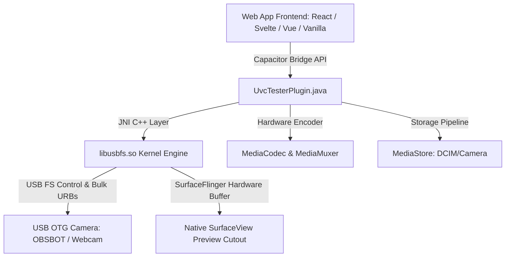

# UVC USB Camera Capacitor Integration Guide

Panduan lengkap arsitektur dan implementasi integrasi kamera USB UVC (seperti **OBSBOT Meet SE**, webcam standar, endoskop, mikroskop USB, dan perangkat capture card) pada aplikasi web berbasis **Capacitor.js** (Vanilla JS, React, Svelte, Vue).

---

## 🏛️ 1. Arsitektur Sistem

Sistem ini menghubungkan antarmuka frontend web modern dengan kernel Android USB OTG berkecepatan tinggi tanpa memerlukan driver root:



### Keunggulan Utama:
- **Zero Root Required**: Menggunakan Android `UsbDeviceConnection` file descriptor (`fd`) dan Linux `usbfs` ioctl.
- **Bulk & Isochronous Support**: Kompatibel dengan kamera generasi baru (seperti OBSBOT Meet SE yang memakai *Bulk Endpoints*) dan webcam standar (*Isochronous Endpoints*).
- **Hardware-Accelerated Encoding**: Perekaman video H.264 MP4 langsung di-encode oleh hardware chipset ponsel dengan koreksi bidang warna (*Chroma Plane Alignment*).
- **Direct Gallery Integration**: Hasil foto dan rekaman video otomatis tersimpan dan terindeks di album bawaan Android (`DCIM/Camera`).

---

## 🔌 2. Deklarasi Antarmuka Plugin (TypeScript Definition)

Definisikan tipe TypeScript atau modul import untuk plugin `UvcTester`:

```typescript
// uvc-camera.ts
import { registerPlugin, PluginListenerHandle } from '@capacitor/core';

export interface ViewportBounds {
  x: number;
  y: number;
  width: number;
  height: number;
}

export interface StartPreviewOptions {
  targetWidth?: number;       // default: 1280 (HD) atau 1920 (FHD)
  targetHeight?: number;      // default: 720 atau 1080
  format?: 'MJPG' | 'YUY2';   // default: 'MJPG'
  mirror?: boolean;           // default: false
  bounds: ViewportBounds;     // Posisi kotak preview di layar HTML
}

export interface DeviceStatus {
  connected: boolean;
  permission: boolean;
  runtimePermissions: boolean;
  deviceName: string;
  vendorId: number;
  productId: number;
}

export interface PhotoResult {
  success: boolean;
  dataUrl: string;            // base64 thumbnail image
  width: number;
  height: number;
  savedPath?: string;         // Lokasi file: DCIM/Camera/IMG_xxx.jpg
  savedFileName?: string;
}

export interface VideoRecordResult {
  success: boolean;
  filePath: string;           // Lokasi file: DCIM/Camera/VID_xxx.mp4
  fileName: string;
  durationMs?: number;
  frameCount?: number;
}

export interface StreamStats {
  streaming: boolean;
  recording: boolean;
  fps: number;
  urbs: number;
}

export interface UvcTesterPlugin {
  testNative(): Promise<{ success: boolean; abi: string; error?: string }>;
  checkDevice(): Promise<DeviceStatus>;
  requestPermission(): Promise<{ granted: boolean; deviceName?: string; message?: string }>;
  startPreview(options: StartPreviewOptions): Promise<{ success: boolean; handleId: number; error?: string }>;
  updateBounds(options: { bounds: ViewportBounds }): Promise<void>;
  takePhoto(options?: { mirror?: boolean }): Promise<PhotoResult>;
  startRecording(): Promise<{ success: boolean; filePath: string; fileName: string }>;
  stopRecording(): Promise<VideoRecordResult>;
  stopPreview(): Promise<{ success: boolean }>;
  getStats(): Promise<StreamStats>;
  addListener(eventName: 'uvcLog', listenerFunc: (data: { message: string; type: string }) => void): Promise<PluginListenerHandle>;
}

export const UvcCamera = registerPlugin<UvcTesterPlugin>('UvcTester');
```

---

## 🎨 3. Aturan Kritis CSS (Transparent Cutout Layout)

Agar video native Android `SurfaceView` dapat terlihat presisi di dalam kotak preview web tanpa tampak melayang (*floating*):

```css
/* Pastikan body dan html transparan */
html, body {
  background-color: transparent !important;
  margin: 0;
  padding: 0;
  width: 100%;
  height: 100%;
  overflow: hidden;
  position: fixed;
}

/* Kotak Preview Kamera dibuat tembus pandang (cutout) */
.camera-viewport {
  width: 100%;
  aspect-ratio: 16 / 9;
  background-color: transparent !important;
  border-radius: 12px;
  overflow: hidden;
  position: relative;
  border: 1px solid #333;
}

/* Elemen antarmuka lainnya (kartu, tombol, header) diberi background solid */
.ui-card {
  background-color: #18181b;
  color: #ffffff;
  border-radius: 12px;
  padding: 12px;
}
```

---

## 💻 4. Contoh Implementasi Framework

### A. React (Custom Hook & Component)

```tsx
// useUvcCamera.ts
import { useState, useEffect, useRef } from 'react';
import { UvcCamera, DeviceStatus, StreamStats } from './uvc-camera';

export function useUvcCamera() {
  const [device, setDevice] = useState<DeviceStatus | null>(null);
  const [isStreaming, setIsStreaming] = useState(false);
  const [isRecording, setIsRecording] = useState(false);
  const [stats, setStats] = useState<StreamStats>({ streaming: false, recording: false, fps: 0, urbs: 0 });
  const viewportRef = useRef<HTMLDivElement | null>(null);

  const getBounds = () => {
    if (!viewportRef.current) return { x: 0, y: 0, width: 0, height: 0 };
    const rect = viewportRef.current.getBoundingClientRect();
    return { x: rect.left, y: rect.top, width: rect.width, height: rect.height };
  };

  const refreshDevice = async () => {
    const res = await UvcCamera.checkDevice();
    setDevice(res);
    return res;
  };

  const startStream = async (targetWidth = 1920, targetHeight = 1080) => {
    const bounds = getBounds();
    const res = await UvcCamera.startPreview({
      targetWidth,
      targetHeight,
      format: 'MJPG',
      mirror: false,
      bounds,
    });
    if (res.success) {
      setIsStreaming(true);
    }
    return res;
  };

  const stopStream = async () => {
    await UvcCamera.stopPreview();
    setIsStreaming(false);
    setIsRecording(false);
  };

  const capturePhoto = async () => {
    return await UvcCamera.takePhoto({ mirror: false });
  };

  const toggleRecording = async () => {
    if (!isRecording) {
      const res = await UvcCamera.startRecording();
      if (res.success) setIsRecording(true);
      return res;
    } else {
      const res = await UvcCamera.stopRecording();
      setIsRecording(false);
      return res;
    }
  };

  useEffect(() => {
    refreshDevice();

    const handleResize = () => {
      if (isStreaming) {
        UvcCamera.updateBounds({ bounds: getBounds() });
      }
    };

    window.addEventListener('resize', handleResize);
    window.addEventListener('orientationchange', () => setTimeout(handleResize, 300));

    const timer = setInterval(async () => {
      if (isStreaming) {
        const s = await UvcCamera.getStats();
        setStats(s);
      }
    }, 1000);

    return () => {
      window.removeEventListener('resize', handleResize);
      clearInterval(timer);
    };
  }, [isStreaming]);

  return {
    viewportRef,
    device,
    isStreaming,
    isRecording,
    stats,
    refreshDevice,
    requestPermission: () => UvcCamera.requestPermission(),
    startStream,
    stopStream,
    capturePhoto,
    toggleRecording,
  };
}
```

```tsx
// CameraScreen.tsx
import React, { useState } from 'react';
import { useUvcCamera } from './useUvcCamera';

export function CameraScreen() {
  const { viewportRef, device, isStreaming, isRecording, stats, requestPermission, startStream, stopStream, capturePhoto, toggleRecording } = useUvcCamera();
  const [photoUrl, setPhotoUrl] = useState<string>('');
  const [statusMsg, setStatusMsg] = useState<string>('');

  return (
    <div className="app-container">
      {/* 1. Viewport Kotak Kamera (Native Surface Render di sini) */}
      <div ref={viewportRef} className="camera-viewport">
        {!isStreaming && <div className="placeholder">Kamera Belum Dimulai</div>}
        {isStreaming && (
          <div className="overlay">
            <span>LIVE ({stats.fps.toFixed(1)} FPS)</span>
            {isRecording && <span className="rec">🔴 REC</span>}
          </div>
        )}
      </div>

      {/* 2. Tombol-tombol Kontrol */}
      <div className="ui-card">
        <p>Status: {device?.connected ? device.deviceName : 'Kamera tidak terdeteksi'}</p>
        <div className="button-group">
          <button onClick={requestPermission}>1. Izinkan USB</button>
          <button onClick={() => startStream(1920, 1080)} disabled={isStreaming}>2. Buka Kamera</button>
          <button onClick={async () => {
            const res = await capturePhoto();
            if (res.success) {
              setPhotoUrl(res.dataUrl);
              setStatusMsg(`Foto tersimpan di ${res.savedPath}`);
            }
          }} disabled={!isStreaming}>📸 Foto</button>
          <button onClick={async () => {
            const res = await toggleRecording();
            if (!isRecording && res.success) {
              setStatusMsg(`Rekaman tersimpan di ${res.filePath}`);
            }
          }} disabled={!isStreaming}>
            {isRecording ? '⏹️ Stop Rekam' : '🔴 Rekam Video'}
          </button>
          <button onClick={stopStream} disabled={!isStreaming}>Tutup Kamera</button>
        </div>
        {statusMsg && <p className="status-msg">💾 {statusMsg}</p>}
      </div>

      {/* 3. Hasil Snapshot */}
      {photoUrl && (
        <div className="ui-card">
          <h4>Hasil Foto Terakhir:</h4>
          
        </div>
      )}
    </div>
  );
}
```

---

### B. Svelte / SvelteKit Component

```svelte
<!-- CameraViewer.svelte -->
<script lang="ts">
  import { onMount, onDestroy } from 'svelte';
  import { UvcCamera } from './uvc-camera';

  let viewportElement: HTMLDivElement;
  let isStreaming = false;
  let isRecording = false;
  let fps = 0;
  let lastPhotoUrl = '';
  let saveMessage = '';

  function getBounds() {
    if (!viewportElement) return { x: 0, y: 0, width: 0, height: 0 };
    const r = viewportElement.getBoundingClientRect();
    return { x: r.left, y: r.top, width: r.width, height: r.height };
  }

  async function handleStart() {
    const res = await UvcCamera.startPreview({
      targetWidth: 1920,
      targetHeight: 1080,
      format: 'MJPG',
      mirror: false,
      bounds: getBounds(),
    });
    if (res.success) isStreaming = true;
  }

  async function handleTakePhoto() {
    const res = await UvcCamera.takePhoto();
    if (res.success) {
      lastPhotoUrl = res.dataUrl;
      saveMessage = `Foto tersimpan di ${res.savedPath}`;
    }
  }

  async function handleToggleRec() {
    if (!isRecording) {
      const res = await UvcCamera.startRecording();
      if (res.success) isRecording = true;
    } else {
      const res = await UvcCamera.stopRecording();
      isRecording = false;
      if (res.success) saveMessage = `Video tersimpan di ${res.filePath}`;
    }
  }

  onMount(() => {
    const timer = setInterval(async () => {
      if (isStreaming) {
        const stats = await UvcCamera.getStats();
        fps = stats.fps;
      }
    }, 1000);

    return () => clearInterval(timer);
  });
</script>

<div class="camera-container">
  <div bind:this={viewportElement} class="camera-viewport">
    {#if isStreaming}
      <div class="overlay">
        <span>LIVE {fps.toFixed(1)} FPS</span>
        {#if isRecording}<span class="rec">🔴 REC</span>{/if}
      </div>
    {/if}
  </div>

  <div class="ui-card">
    <button on:click={() => UvcCamera.requestPermission()}>Izinkan USB</button>
    <button on:click={handleStart} disabled={isStreaming}>Start Preview</button>
    <button on:click={handleTakePhoto} disabled={!isStreaming}>📸 Snapshot</button>
    <button on:click={handleToggleRec} disabled={!isStreaming}>
      {isRecording ? '⏹️ Stop Rec' : '🔴 Record'}
    </button>
    <button on:click={async () => { await UvcCamera.stopPreview(); isStreaming = false; }} disabled={!isStreaming}>Stop</button>

    {#if saveMessage}
      <p class="saved-toast">💾 {saveMessage}</p>
    {/if}
  </div>
</div>
```

---

### C. Vue 3 (Composition API)

```vue
<!-- CameraView.vue -->
<template>
  <div class="app-layout">
    <div ref="viewportRef" class="camera-viewport">
      <div v-if="isStreaming" class="overlay">
        <span>LIVE {{ fps.toFixed(1) }} FPS</span>
        <span v-if="isRecording" class="rec">🔴 REC</span>
      </div>
    </div>

    <div class="ui-card">
      <button @click="requestUsb">1. Request USB</button>
      <button @click="startStream" :disabled="isStreaming">2. Start Preview</button>
      <button @click="takePhoto" :disabled="!isStreaming">📸 Photo</button>
      <button @click="toggleRec" :disabled="!isStreaming">
        {{ isRecording ? '⏹️ Stop Rec' : '🔴 Record' }}
      </button>
      <button @click="stopStream" :disabled="!isStreaming">Stop</button>
      <p v-if="savedNote">📁 {{ savedNote }}</p>
    </div>
  </div>
</template>

<script setup lang="ts">
import { ref, onMounted, onUnmounted } from 'vue';
import { UvcCamera } from './uvc-camera';

const viewportRef = ref<HTMLDivElement | null>(null);
const isStreaming = ref(false);
const isRecording = ref(false);
const fps = ref(0);
const savedNote = ref('');

function getBounds() {
  if (!viewportRef.value) return { x: 0, y: 0, width: 0, height: 0 };
  const r = viewportRef.value.getBoundingClientRect();
  return { x: r.left, y: r.top, width: r.width, height: r.height };
}

async function requestUsb() {
  await UvcCamera.requestPermission();
}

async function startStream() {
  const res = await UvcCamera.startPreview({
    targetWidth: 1920,
    targetHeight: 1080,
    format: 'MJPG',
    mirror: false,
    bounds: getBounds(),
  });
  if (res.success) isStreaming.value = true;
}

async function takePhoto() {
  const res = await UvcCamera.takePhoto();
  if (res.success) savedNote.value = `Foto: ${res.savedPath}`;
}

async function toggleRec() {
  if (!isRecording.value) {
    const res = await UvcCamera.startRecording();
    if (res.success) isRecording.value = true;
  } else {
    const res = await UvcCamera.stopRecording();
    isRecording.value = false;
    if (res.success) savedNote.value = `Video: ${res.filePath}`;
  }
}

async function stopStream() {
  await UvcCamera.stopPreview();
  isStreaming.value = false;
  isRecording.value = false;
}

let timer: any;
onMounted(() => {
  timer = setInterval(async () => {
    if (isStreaming.value) {
      const stats = await UvcCamera.getStats();
      fps.value = stats.fps;
    }
  }, 1000);
});

onUnmounted(() => clearInterval(timer));
</script>
```

---

## 🛠️ 5. Menambahkan Plugin ke Project Capacitor Baru

Jika Anda ingin memindahkan plugin ini ke project aplikasi Capacitor Anda yang lain:

1. **Salin Native Code**:
   - Salin folder `android/app/src/main/java/com/uvctester/app/` (termasuk folder `uvc/`, `media/`, dan `com/homesoft/`).
   - Salin folder file C++ binary: `android/app/src/main/jniLibs/` (`arm64-v8a`, `armeabi-v7a`, `x86_64` yang berisi `libusbfs.so`).
2. **Daftarkan Permission di `AndroidManifest.xml`**:
   ```xml
   <uses-permission android:name="android.permission.CAMERA" />
   <uses-permission android:name="android.permission.RECORD_AUDIO" />
   <uses-feature android:name="android.hardware.usb.host" android:required="true" />
   ```
3. **Daftarkan Plugin di `MainActivity.java`**:
   ```java
   package com.yourapp.app;

   import android.os.Bundle;
   import com.getcapacitor.BridgeActivity;
   import com.uvctester.app.uvc.UvcTesterPlugin;

   public class MainActivity extends BridgeActivity {
       @Override
       public void onCreate(Bundle savedInstanceState) {
           registerPlugin(UvcTesterPlugin.class);
           super.onCreate(savedInstanceState);
       }
   }
   ```
4. **Build & Jalankan**:
   ```bash
   npm run build
   npx cap sync android
   ```
